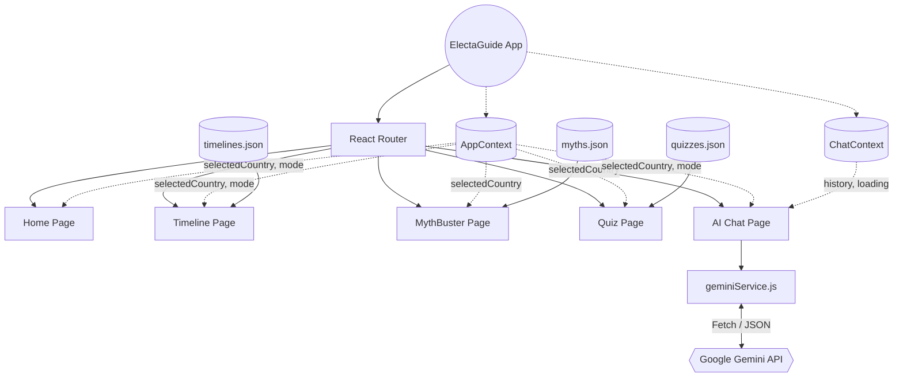

# ElectaGuide 

> **Your personal guide to understanding elections — simple, clear, and empowering.**

ElectaGuide is an interactive, AI-powered civic education web application built to demystify the democratic process. It provides personalized, country-specific electoral timelines, debunks common voting myths, tests user knowledge through interactive quizzes, and features a conversational AI assistant capable of adapting to beginner or advanced learners.

---

## 🌟 Key Features

- **Global Context, Local Nuance:** Select from 5 major democracies (India, USA, UK, Australia, Germany) to learn about their specific election rules and systems.
- **Interactive Timelines:** Step-by-step visual guides explaining the election process from voter registration to Election Day.
- **MythBuster Mode:** Beautifully animated flip-cards that debunk common voting myths with hard facts and historical examples.
- **Dynamic Quizzes:** A state-driven quiz engine that tests your knowledge and celebrates your success with interactive confetti.
- **The "AI Brain" (Powered by Gemini 2.5 Flash):** A deeply integrated, context-aware AI tutor. It knows what country you selected, respects your learning level (Beginner/Advanced), and acts as a non-partisan civic guide.

---

## 🛠️ Technology Stack

- **Frontend Framework:** React (Vite)
- **Styling:** Tailwind CSS v3
- **State Management:** React Context API (`AppContext`, `ChatContext`)
- **Routing:** React Router v6
- **Animations:** Framer Motion, React Confetti
- **AI Integration:** Google Gemini API (`gemini-2.5-flash`)
- **Data Architecture:** High-performance, hardcoded JSON stores for instantaneous loads.

---

## 🏛️ Architecture Diagram



---

## 🚀 Getting Started Locally

### Prerequisites
- Node.js (v16+)
- A Google Gemini API Key

### Installation

1. **Clone the repository:**
   ```bash
   git clone https://github.com/yourusername/electraguide.git
   cd electraguide
   ```

2. **Install dependencies:**
   ```bash
   npm install
   ```

3. **Configure Environment Variables:**
   Create a `.env.local` file in the root directory and add your Gemini API key:
   ```env
   VITE_GEMINI_API_KEY=your_gemini_api_key_here
   ```

4. **Start the Development Server:**
   ```bash
   npm run dev
   ```
   *The application will automatically open or be available at `http://localhost:5173/`*

---

## 🌍 Deployment

ElectaGuide is optimized to be deployed as a static Single Page Application (SPA). For Firebase Hosting:

1. Build the production application:
   ```bash
   npm run build
   ```
2. Initialize Firebase (if not already done):
   ```bash
   firebase init hosting
   ```
   *(Select the `dist` folder as the public directory, and configure as a single-page app).*
3. Deploy:
   ```bash
   firebase deploy --only hosting
   ```

---

*Built with Google Antigravity for PromptWars 2026 🚀 | Civic Education for Everyone*
